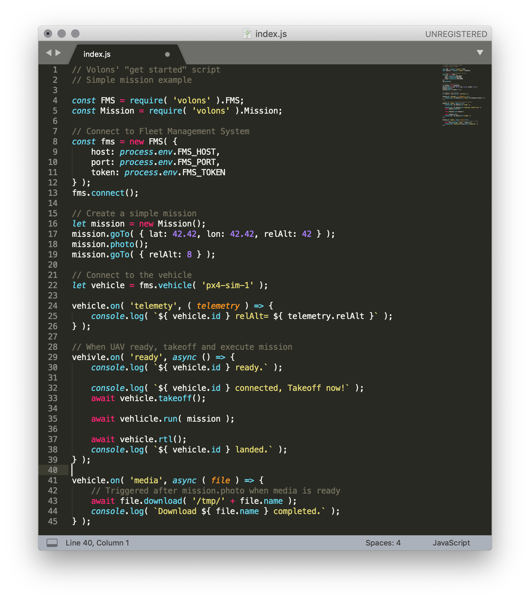

# Volons (Alpha)

Volons is still early access alpha software, use at your own risk.

kk
# Volons - Get Started
__Open Source Internet of Drone Plateform__

Volons is composed of 4 main opensource software. You can download source code, install and run it manually.
We build docker images for you to go strait-forward to the interesting part: __Coding and connecting mission for UAVs__.

__Main components__:


1. **Vehicles** ( px4 / dji ) are components directly connected to the flight controller
1. **Hive** is backend application managing security and authorizations
1. **Monitor** is a web application using Volons Javascript SDK to watch and control flights in real-time
1. **Volons Javascript SDK** is the part you are going to interact with to code dynamic missions and triggers

Volons' API is object-oriented and easy to install, use and run.


Let's start. You don't need to know everything about Volons at this point.
You can get more information by browsing Volons' [github repository](https://github.com/volons/).

This document presents a step-by-step tutorial and explanations on how to start coding for drones.

- [Install and init Volons on your computer](#install-and-init-local-volons-developer-stack)
- [Write your fist program this Volons Javascript SDK](#volons-sdk-for-nodejs)
- [Monitor mission](#run-and-monitor-simulator)

Second part ( advanced ):

- [Advanced Volons API Features](#advanced-api-features)
- [Connect aircrafts](#connect-aircrafts)
- [Install and host Volons for production](#install-and-host-volons)

You are familiar with **Nodejs** and **Docker**! So, you are going to install your development platform then takeoff and monitor a px4-simulator in ~20 minutes.


## Install And Init Local Volons Developer Stack

### Requirements

You need standard third-party software to run Volons.

- Node.js with npm [https://nodejs.org](https://nodejs.org)
- Docker [https://www.docker.com/](https://www.docker.com/)
- Docker Compose [https://docs.docker.com/compose/install/](https://docs.docker.com/compose/install/)
- Git [https://git-scm.com/](https://git-scm.com/)

Its are probably already installed. If not, you should do it before to continue.

### Volons Command Line Interface

Volons node module comes with a command line interface.
To install Volons CLI execute

    $ npm i -g volons

This sofware helps you to init, run and monitor volons local plateform.

- `volons start`: start volons containers you've just create with `volons init`
- `volons stop`: stop volons running containers
- `volons ps`: print usefull information about running containers (ip address, ports, name, env...)
- `volons monitor`: open default web browser with Fleet Management System Monitor URL ( and print this URL )
- `volons help`: print help message How to use volons CLI

**How it works**

Volons local stack is composed by 4 docker images. Volons CLI executes docker-compose and docker commands to handle volons' containers. First, `volons init` generates a docker-compose.yml and save it.
Then, `volons start` runs `docker-compose up` to start containers with docker. If you are familiar with docker, you can download Volons' container images directly from [Dockerhub](https://hub.docker.com/u/volons) and configure more complecated stack. Add many Fleet Mangment System and drones. Docker images are built from Volons' [repositories (github.com)](https://github.com/volons/).


Your containers run all togather. Your local plateforme is ready and you can connect with de SDK to takeoff.

### Connect Hive

Create new folder to store your first mission with Volons.

    $ mkdir first-project-with-volons
    $ cd first-project-with-volons

Init a Nodejs project add Volons npm, and copy takeoff.js sample code from volons sample code folder.

    $ npm init
    $ npm install volons --save
    $ cp ./node_modules/volons/examples/Takeoff.js ./Takeoff.js

takeoff.js is a trival sample code. Edit Takeoff.js file to add your personal Token created by `volons init`.

```javascript
// This Volons script is a trivial script that
// - Connect a drone through Volons' FleetManagementSystem stack
// - Send ARM and TAKEOFF
// - Wait end of takeoff command
// - land

const volons = require( 'volons );
const _ADMIN_TOKEN_ = '0123456789abcdef0123456789ABCDEF0123456789abcdef0123456789ABCDEF' // Set your token here.
// TOBE implemented.
```

Open the monitor to watch drone and mission execution

    volons monitor

Finaly, execute your mission

    node ./takeoff.js

__Get more examples__

> Browse the volons sample code directory to get more examples.

    $ ls ./node_modules/volons/examples/

> * takeoff.js: Trivial mission to `Takeoff` ( the one we've just talk about )
> * mission.js: Demo of `mission.goto()` and manage air lift
> * weather.js: Connect real-time weather API as a condition to takeoff
> * events.js: Use `events` to connect drone's events, this demo shows how to post a message on a slack channel when the drone is landed

Then you are able to code and connect your own program using the Volons SDK.


### Docker images

After running volons with `volons start`, you can execute 

    volons ps

This command print usefull information about running volons container on your computer.

* *drone-1*: docker-compose starts a px4 drone simulator
* *px4-simulator*: Gazebo based docker image with custom Volons configuration
* *px4-vehicle*: the embedded software to connect drone with MAVLink
* *FleetManagmentSystem*: connect drone and SDK to manage fleet security

--------------------


    > git clone volons/px4-simulator
    > git clone volons/fms
    > git clone volons/volons-cli
    > cd volons-cli
    > docker-compose up

Volons comes with an all-in-one docker-compose project.
Start cloning volons projects from GitHub and then start containers in a glance.

Within another console, execute `> docker ps`


* *drone-1*: docker-compose starts a px4 drone simulator
* *px4-simulator*: Gazebo based docker image with custom Volons configuration
* *px4-vehicle*: the embedded software to connect drone with MAVLink
* *FleetManagmentSystem*: connect drone and SDK to manage fleet security

Volons' 4 docker images are ready to work collectively.


## Volons API For Nodejs

### Starter Scripts

You can write and run your nodejs script to connect UAVs from scratch, but you should use 'starter script' to learn Volons' basics.

Let's go through an example:

    > git clone volons/starter-scripts
    > cd starter-scripts
    > npm i
    > node takeoff.js

This program is going to connect the FMS with the Volons javascript API.
Then it waits for drone connections; the docker image: `drone-1` is configured to connect the same FMS.
`drone-1` takeoffs and climbs to 20 meters then land.

This is a very trivial mission.



Starter scripts directory:

* takeoff.js: Trivial mission to `Takeoff` ( the one we've just talk about )
* mission.js: Demo of `mission.goto()` and manage air lift
* weather.js: Connect real-time weather API as a condition to takeoff
* events.js: Use `events` to connect drone's events, this demo shows how to post a message on a slack channel when the drone is landed

### npm i volons

Get technical information about Volons API to write an advanced program using aircraft.

* [npmjs.org/volons](https://www.npmjs.com/package/volons)
* [Volons API Documentation](https://api.volons.fr)
* [github.com/volons/npm](https://api.volons.fr)

You'll find helpful information from the [community](https://community.volons.fr).

```javascript
import {Hive} from 'volons';

async function main() {
    let hive = new Hive( 'ws://localhost:8081/admin' );
    await hive.connect();

    console.log('connected to hive');

    let vehicle = hive.vehicle( 'dev' );
    await vehicle.connect();

    console.log('connected to vehicle');

    console.log('takeoff');
    await vehicle.takeoff();
    console.log('in air');
}

main().catch( ( err ) => console.error( err ) );
```

## Monitor

Open [http://localhost:13112/monitor/](http://localhost:13112/monitor) to watch you mission running.

Monitor is a web app for supervision and FMS management.

* Real-time UAVs geolocalisation and altitude rendering using Google Map API
* Actions: `Stop`, `Start`, `Pause` and `Resume` mission
* Take realtime controls: `Enter cockpit`
* Mission preview waypoints and actions
* Real-time webRTC video stream
* Real-time telemetry


This is the end of the fist part.
You are now ready to connect drones with your API, extend mission's capabilities and implement alerts or custom triggers.

__PART II__

The second part introduces advanced features that you should be interested in too.
You can write code though you want to connect real drones and run in production, don't you?

## Connect Aircrafts

### PX4 ( MAVLink ) flight controller

Volons comes with a px4-vehicle prebuild image for Raspberry Pi.
Flash your SD card with Volons' image below and connect the controller to the serial port

* Download Volons/px4-simulator image for RaspberryPI

or download vehicl-px4 volons' source code: `git clone volons/vehicle-px4`

Then, connect Raspberry Pi's GPIO to Flight Controler serial port. There is a picture using a RasperryPi2 and a Pixhawk.


[Communicating with Raspberry Pi via MAVLink](http://ardupilot.org/dev/docs/raspberry-pi-via-mavlink.html) or watch [Connecting Raspberry Pi w/ Pixhawk and Communicating via MAVLink Protocol](https://www.youtube.com/watch?v=DGAB34fJQFc) tutorial on Youtube.

### DJI flight controller
For DJI drones, Volons comes with an Android JAVA native application to connect Volons. Download pre-build version on the PlayStore:

- [Volons for Android](https://www.volons.fr/dji/)

or build and run local Android App with volons/dji-vehicle: `git clone volons/vehicle-dji`


## Volons To Production

Volons Fleet Management System is dockerized, you can choose the hosting provider you want

    docker clone volons/fms
    docker run volons/fms

* __AWS__: To deploy docker container to Amazon Web Services read: [Running Docker on AWS EC2](https://hackernoon.com/running-docker-on-aws-ec2-83a14b780c56) on Hackernoon.
* __Azure__: To deploy docker container to Microsoft Azure read: [Run Docker containers with Azure Container Instances](https://docs.microsoft.com/en-us/learn/modules/run-docker-with-azure-container-instances/)
* __OVH__: To deploy docker with OVH read: [Docker running on OVH VPS ](https://medium.com/sroze/docker-running-on-ovh-vps-ubuntu-14-04-2422228add2c)
* __Clever-Cloud__: To deploy docker images with clever-cloud read: [Deploy Docker images](https://www.clever-cloud.com/doc/docker/docker/)

Finaly, get help to deploy Volons from the [community](https://community.volons.fr/).


## Licence

## Contact us

Volons is developped and maintained by Volons SAS, based in France, contact us at __contact@volons.fr__

__Usefull links:__

* [Api documentation](https://api.volons.fr)
* [NPM Volons](https://npm.volons.fr)
* [Volons Community](https://community.volons.fr)
* [Github](https://github.com/volons)

