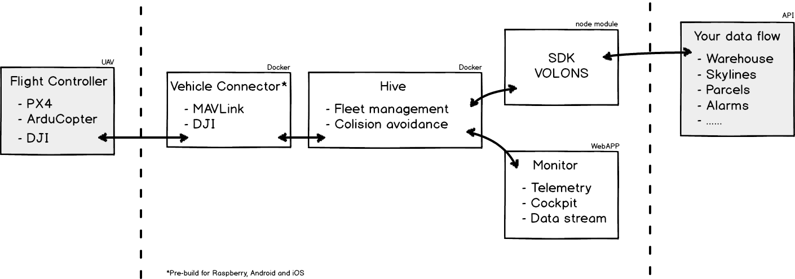
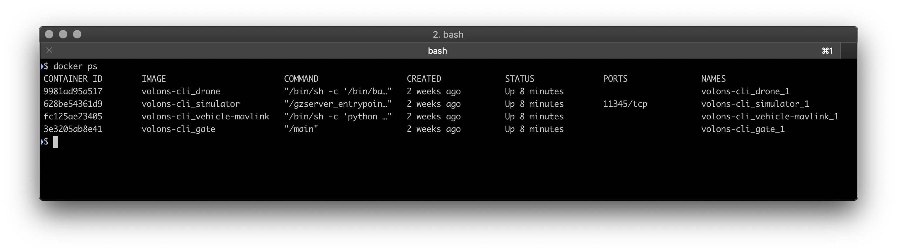

__Volons is still early access alpha software, use at your own risk.__


```javascript
import {Hive} from 'volons';

(async function main() {
    let hive = new Hive( 'ws://localhost:8656/admin' );
    await hive.connect();
    let vehicle = hive.vehicle( 'dev' );
    await vehicle.connect();
    await vehicle.takeoff();
})();
```

## Running local stack
```
$ npm i -g volons
$ volons start
```

## Installation
```
$ npm i volons
```

## Volons: Open Source Internet of Drone Plateform

Volons is composed of 4 main opensource software. You can download source code, install and run it manually.
We build docker images for you to go strait-forward to the interesting part: __Coding and connecting mission for UAVs__.

__Main components__:
1. **Vehicles** ( px4 / dji ) are components directly connected to the flight controller
1. **Hive** is backend application managing security and authorizations
1. **Monitor** is a web application using Volons Javascript SDK to watch and control flights in real-time
1. **Volons Javascript SDK** is the part you are going to interact with to code dynamic missions and triggers

Volons' API is object-oriented and easy to install, use and run.



Let's start. You don't need to know everything about Volons at this point.
You can get more information by browsing [Volons' github repository](https://github.com/volons/) and [Volons WIKI](https://github.com/volons/volons/wiki).

This document presents a step-by-step tutorial and short explanations on how to start coding for drones.

- [Install and start Volons on your computer](#install-and-start-local-volons-developer-stack)
- [Write your fist program this Volons Javascript SDK](#volons-sdk-for-nodejs)
- [Run and monitor mission](#run-and-monitor-simulator)

You are familiar with **Nodejs** and **Docker**! So, you are going to install your development platform then takeoff and monitor a px4-simulator in ~20 minutes.


## Install And Start Local Volons Developer Stack

### Requirements
You need standard third-party software to run Volons.

- Node.js with npm [https://nodejs.org](https://nodejs.org)
- Docker [https://www.docker.com/](https://www.docker.com/)
- Docker Compose [https://docs.docker.com/compose/install/](https://docs.docker.com/compose/install/)
- Git [https://git-scm.com/](https://git-scm.com/)

Its are probably already installed. If not, you should do it before to continue.

### Volons Command Line Interface
Volons node module comes with a command line interface (CLI). To install Volons CLI run:

    $ npm i -g volons

This sofware helps you to start Volons' local plateform.

_Volons CLI arguments_:
- `volons start`: start volons containers (Hive, simulator, vehicle-mavlinl)
- `volons stop`: stop volons running containers
- `volons ps`: print usefull information about running containers (ip address, ports, name, env...)
- `volons help`: print help message How to use volons CLI
- `volons pull`: Download latest docker images from [Docker Hub](https://cloud.docker.com/u/volons/repository/list) 

**How it works**

Volons local stack is composed by 4 docker images. Volons CLI executes docker-compose and docker commands to handle volons' containers. First, `volons start` downloads 3 images from Docker Hub.
Then, by running `docker-compose up` to start containers with docker. If you are familiar with docker, you can download Volons' container images directly from [Dockerhub](https://hub.docker.com/u/volons) and configure more complecated stack. Add many hives and drones. Volons docker images are automaticly build from github sources.


Your containers run all togather. Your local plateforme is ready and you can connect with de SDK to start your firs mission.

View running containers:
```
$ volons ps
```
This command diplays usefull information about Volons containers on your local computer.

You should see 3 running containers:
* *simulator*: [Dronekit-SITL](https://github.com/dronekit/dronekit-sitl) based docker image with custom Volons configuration
* *vehicle-mavlink*: the Volons adaptor for MAVLink vehicles (Arducupter)
* *hive*: the Fleet Management System to connect drone and SDK


### Use Volons node module to write code for drones with nodejs

Create new folder to store your first program using Volons.

    $ mkdir first-project-with-volons
    $ cd first-project-with-volons

Init a Nodejs project and install Volons package. Copy takeoff.js sample code from volons sample code folder.

    $ npm install volons --save
    $ cp ./node_modules/volons/examples/takeoff.js ./takeoff.js

takeoff.js is a trival sample code.

    $ cat ./takeoff.js
```javascript
// This Volons script is a trivial script that
// - require Volons' library
// - connect Hive
// - connect aircraft
// - Send Takeoff command to drone

const { Hive } = require('volons');

async function main() {
    let hive = new Hive('ws://localhost:8656/admin');
    await hive.connect();

    console.log('Connected to hive');

    let vehicle = hive.vehicle('dev');
    await vehicle.connect();

    console.log('Connected to vehicle');

    console.log('takeoff');
    await vehicle.takeoff();
    console.log('Dev is flying');
}
```

__Get more examples__

> Browse the [volons sample code directory](https://github.com/volons/volons/tree/master/examples) to get more examples.

    $ ls ./node_modules/volons/examples/

> * takeoff.js: Trivial mission to `Takeoff`. The one we've just talk about.
> * mission.js: Demo of `mission.goto()` and manage air lift (comming soon).
> * weather.js: Connect real-time weather API as a condition to takeoff (comming soon).
> * events.js: Use `events` to connect drone's events, this demo shows how to post a message on a slack channel when the drone is landed (comming soon).

## Docker Images

If you want to handle volons images and containers manualy. 

```
$ docker pull volons/hive
$ docker run -i volons/hive
```

Volons comes with an all-in-one docker-compose project.
Start cloning volons projects from GitHub and then start containers in a glance.

Within another console, execute `> docker ps`



* *drone-1*: docker-compose starts a px4 drone simulator
* *px4-simulator*: Gazebo based docker image with custom Volons configuration
* *px4-vehicle*: the embedded software to connect drone with MAVLink
* *FleetManagmentSystem*: connect drone and SDK to manage fleet security

Volons' 4 docker images are ready to work collectively.


## Volons API For Nodejs

### Starter Scripts

You can write and run your nodejs script to connect UAVs from scratch, but you should use 'starter script' to learn Volons' basics.

Let's go through an example:

    $ npm i
    $ node takeoff.js

This program is going to connect the FMS with the Volons javascript API.
Then it waits for drone connections; the docker image: `drone-1` is configured to connect the same FMS.
`drone-1` takeoffs and climbs to 20 meters then land.

This is a very trivial mission.
Starter scripts directory:


* takeoff.js: Trivial mission to `Takeoff` ( the one we've just talk about )
* mission.js: Demo of `mission.goto()` and manage air lift
* weather.js: Connect real-time weather API as a condition to takeoff
* events.js: Use `events` to connect drone's events, this demo shows how to post a message on a slack channel when the drone is landed

### npm i volons

Get technical information about Volons API to write an advanced program using aircraft.

* [npmjs.org/volons](https://www.npmjs.com/package/volons)
* [Volons API Documentation](https://api.volons.fr)
* [github.com/volons/npm](https://api.volons.fr)


```javascript
import {Hive} from 'volons';

async function main() {
    let hive = new Hive( 'ws://localhost:8081/admin' );
    await hive.connect();

    console.log('connected to hive');

    let vehicle = hive.vehicle( 'dev' );
    await vehicle.connect();

    console.log('connected to vehicle');

    console.log('takeoff');
    await vehicle.takeoff();
    console.log('in air');
}

main().catch( ( err ) => console.error( err ) );
```

## Monitor
The `volons/simulator` docker image should connect to your local [QGroundControl](https://github.com/mavlink/qgroundcontrol).

_Coming soon_: Volons provides a web based application using the Volons SDK to display your Aircraft on a map with telemetry data.

## Connect Aircrafts
You can find more information on our vehicle adaptors repositories:

* _Mavlink aircrafts_: [https://github.com/volons/vehicle-mavlink](https://github.com/volons/vehicle-mavlink)
* _DJI aircrafts_: [https://github.com/volons/vehicle-dji](https://github.com/volons/vehicle-dji)

Feel free to contact us to get help building software for your drones.


## MIT Licence
Copyright (c) 2019 Volons SAS, https://www.volons.fr


## Contact us
Volons is developped and maintained by Volons SAS, based in France, contact us at __contact@volons.fr__


__Usefull links:__

* [Api documentation](https://github.com/volons/volons/wiki)
* [NPM Volons](https://npm.volons.fr)
* [Github](https://github.com/volons)
